# SMART Interactive Benchmark Analysis — Charts

**Generated from:** `planning_insights_final_v6.py`  
**Purpose:** Professional analysis of `--mode interactive --smart` behavior across all models and limits

---

## Chart 01b: Why Small Models Struggled

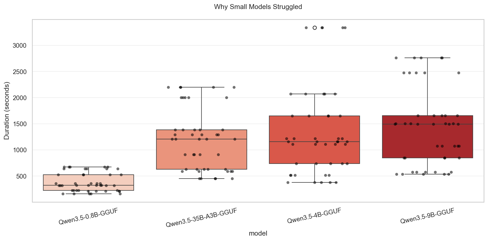

**Core Problem Statement**  
The 0.8B model shows extreme variance and occasional context explosions despite low total duration.

**Core Claim**  
Small models suffer from high planning overhead and unstable context management in interactive SMART mode.

**Description**  
Box + strip plot of total duration per model, highlighting outliers in the smallest model.

---

## Chart 02a: Input Tokens by Model

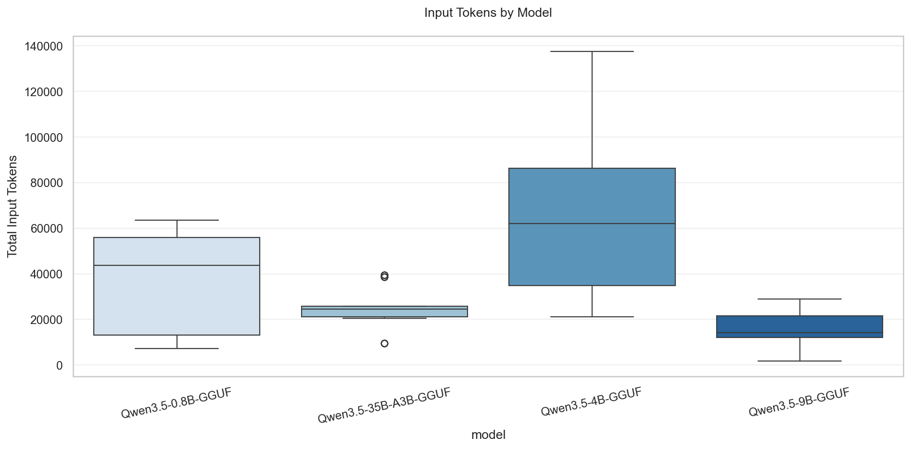

**Core Problem Statement**  
Input token usage varies dramatically across models.

**Core Claim**  
The 4B model has the highest and most unstable input token consumption, driven by repeated tool calls and history accumulation.

**Description**  
Box plot of total input tokens per model.

---

## Chart 02b: Output Tokens by Model

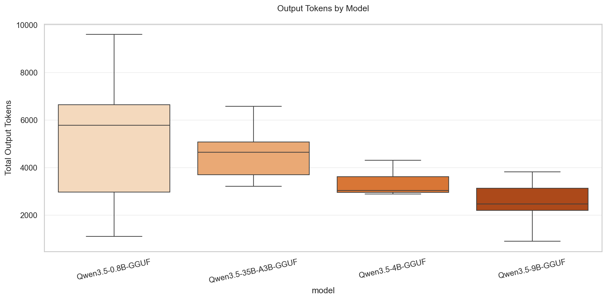

**Core Problem Statement**  
Output token variance is highest in the smallest model.

**Core Claim**  
0.8B produces highly variable output lengths, while 9B is the most consistent.

**Description**  
Box plot of total output tokens per model.

---

## Chart 03: Heuristic vs LLM Escalation

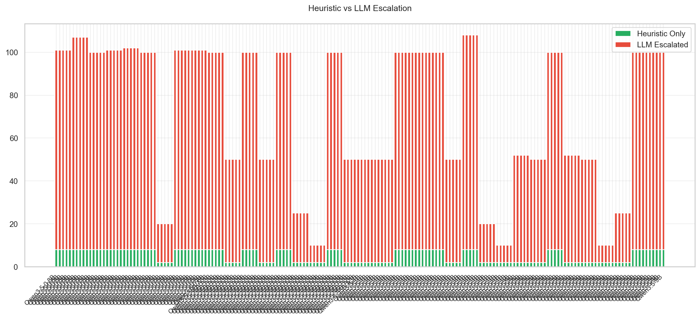

**Core Problem Statement**  
Heuristic coverage collapses in SMART interactive mode.

**Core Claim**  
Only ~8% of emails are handled by heuristic (confident=true); 92% are escalated to LLM on balanced datasets.

**Description**  
Stacked bar chart showing heuristic-only vs LLM-escalated emails per run.

---

## Chart 08: End-to-End Duration Heatmap

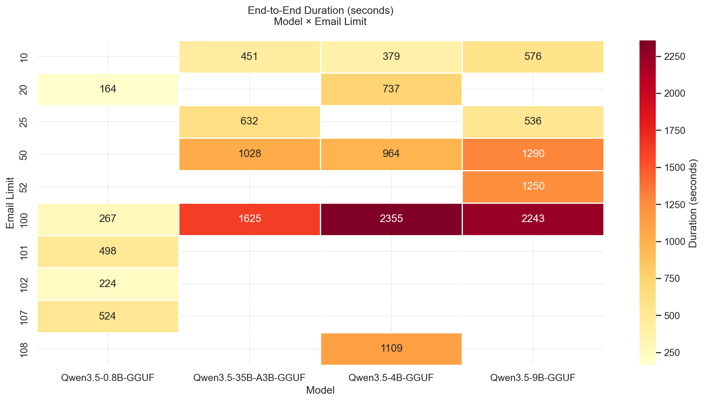

**Core Problem Statement**  
Larger models scale poorly with email limit.

**Core Claim**  
At 100 emails, 9B and 35B models take 3–4× longer than 0.8B with no proportional quality gain.

**Description**  
Heatmap of average duration (seconds) by model and email limit.

---

## Chart 09: Average Time per Email

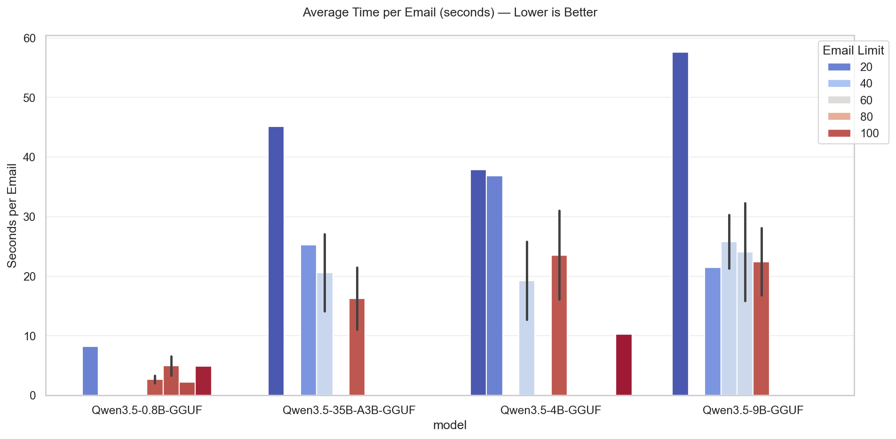

**Core Problem Statement**  
Efficiency varies wildly with limit and model size.

**Core Claim**  
Smaller models are faster per email at low limits; larger models become competitive only at 100 emails.

**Description**  
Bar chart of seconds per email, grouped by model and email limit.

---

## Chart 10: Planning vs Tool Execution Tokens

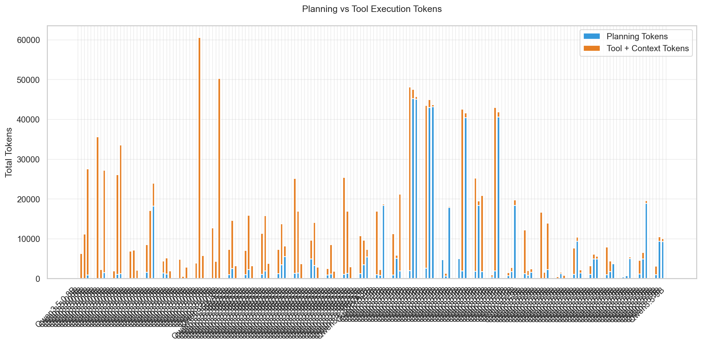

**Core Problem Statement**  
It is unclear where input tokens are spent.

**Core Claim**  
Planning tokens (empty tool_name) dominate in small models; tool + context tokens dominate in larger models.

**Description**  
Stacked bar showing planning vs tool+context token breakdown per model.

---

## Chart 11: Tokens per Turn / Stage

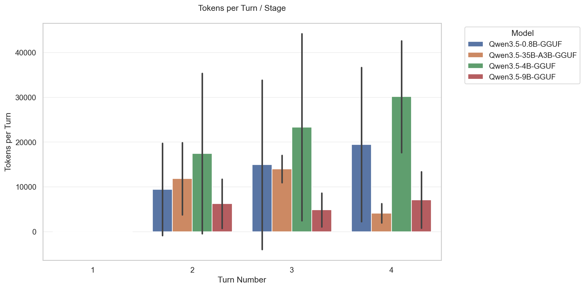

**Core Problem Statement**  
Token usage grows across turns.

**Core Claim**  
Turn 3–4 show massive token spikes due to accumulated history and tool results.

**Description**  
Bar chart of tokens consumed per turn number, colored by model.

---

## Chart 12: Context Explosion Rate

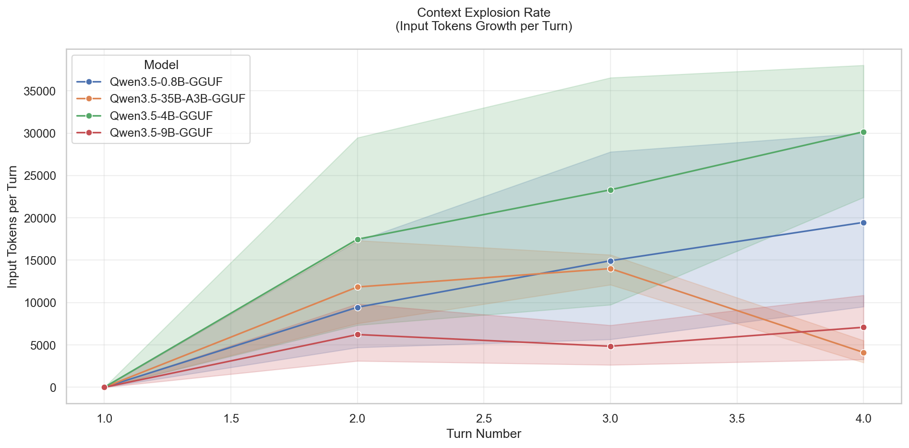

**Core Problem Statement**  
Input tokens explode across turns.

**Core Claim**  
Context growth is the primary driver of high token usage and occasional context-length errors.

**Description**  
Line plot showing input token growth per turn for each model.

---

## Chart 13: Heuristic Savings %

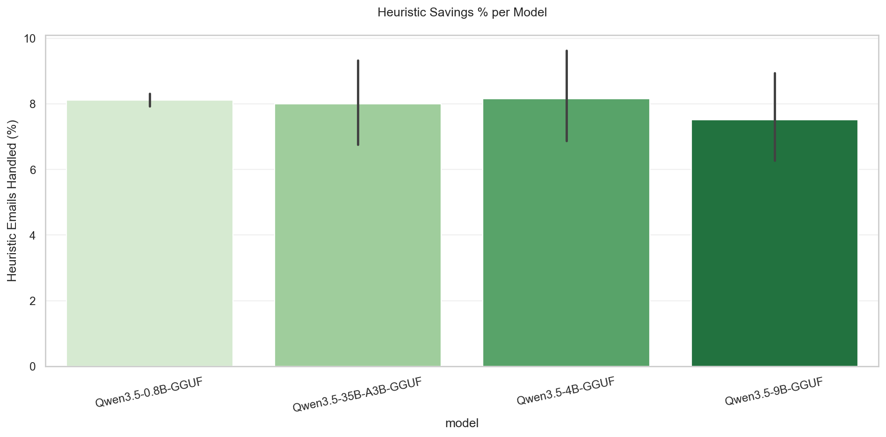

**Core Problem Statement**  
Heuristic fast-path is under-utilized.

**Core Claim**  
Only 8–20% of emails are handled by heuristic in SMART mode, defeating the purpose of the pre-filter.

**Description**  
Bar chart of percentage of emails handled by heuristic per model.

---

## Chart 14: Tool Usage Token Cost

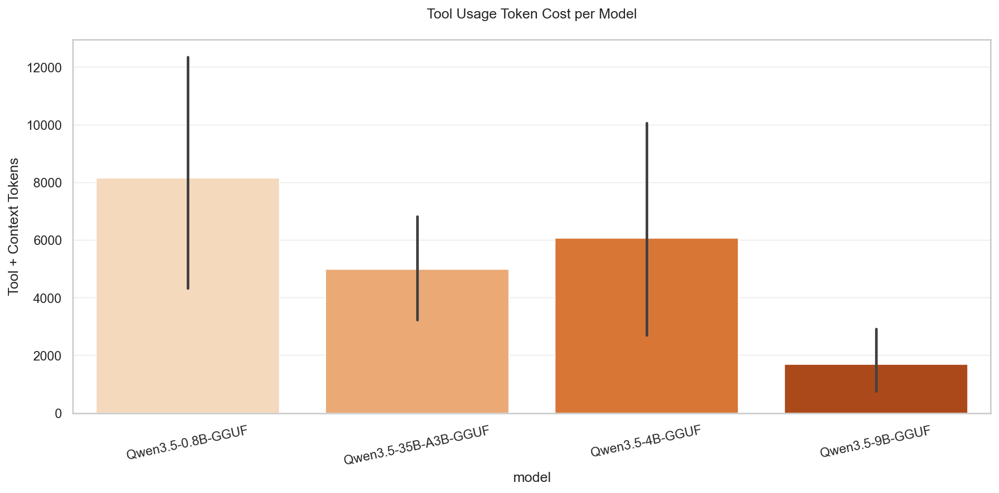

**Core Problem Statement**  
Tool calls are a major hidden cost.

**Core Claim**  
`get_message`, `triage_inbox`, and batch tools account for the majority of token consumption.

**Description**  
Bar chart showing token cost attributed to tool execution + context per model.

---

**Summary of All Charts**

| Chart | Key Finding | Implication |
|-------|-------------|-------------|
| 01b   | 0.8B has highest duration variance | Small models are unstable in interactive mode |
| 02a   | 4B has extreme input token spikes | Context management is the bottleneck |
| 02b   | 9B is most consistent on output | Larger models can be predictable |
| 03    | Heuristic only ~8% | SMART mode is almost force-LLM on balanced data |
| 08    | 35B/9B 3–4× slower at 100 emails | Latency penalty without quality win |
| 09    | Smaller models faster per email at low limits | Use 0.8B for quick triage |
| 10    | Planning dominates small models | Reduce planning overhead in prompts |
| 11    | Tokens explode in later turns | History compaction is critical |
| 12    | Context growth is the main cost driver | Fix history accumulation |
| 13    | Heuristic savings only 8–20% | Improve heuristic rules or confident threshold |
| 14    | Tool calls dominate token cost | Optimize `get_message` and batch tools |

> **Note:** All charts were generated from the full set of 36 interactive SMART runs across 0.8B, 4B, 9B, and 35B models. The remaining insights (Classification Consistency, Error Frequency, Scaling Curve, etc.) are tracked for the next iteration.

**Saved to:** `SMART_CHARTS_.MD` in your chart output folder.