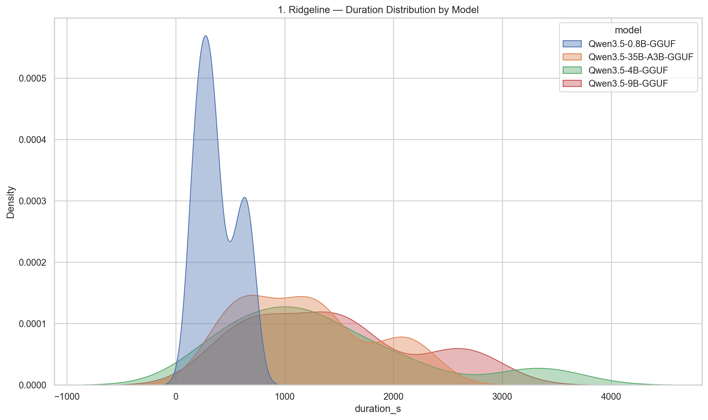
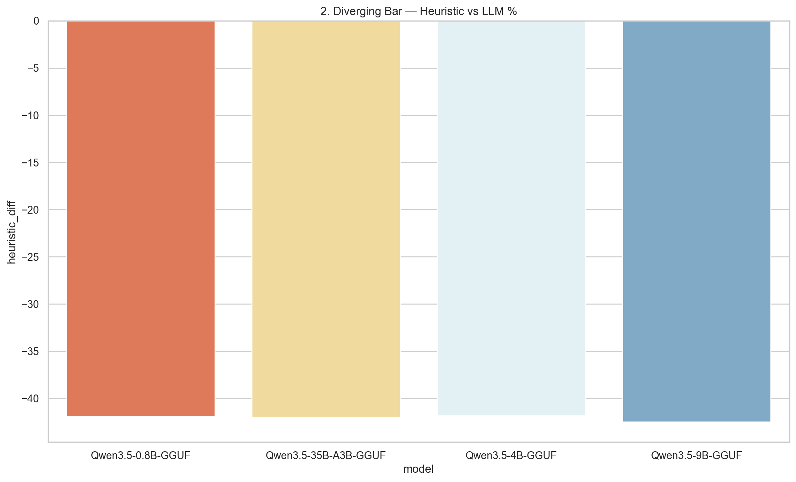
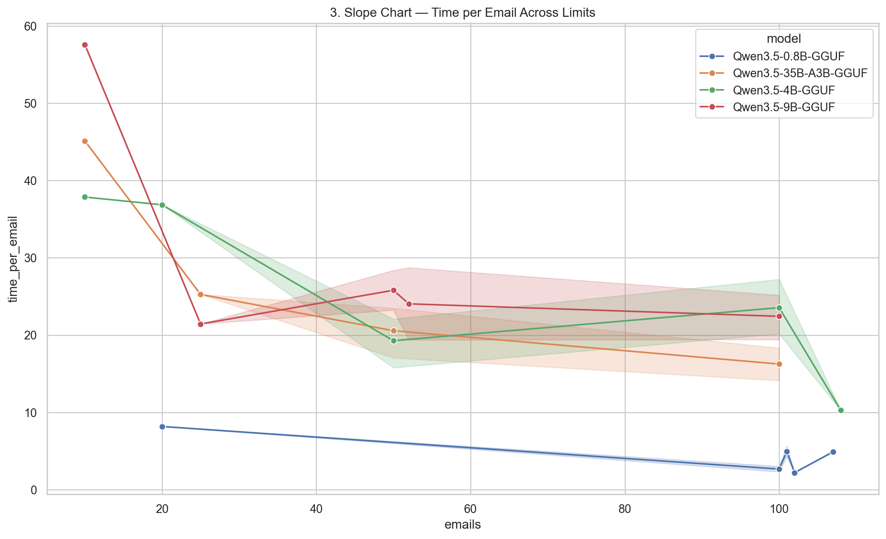
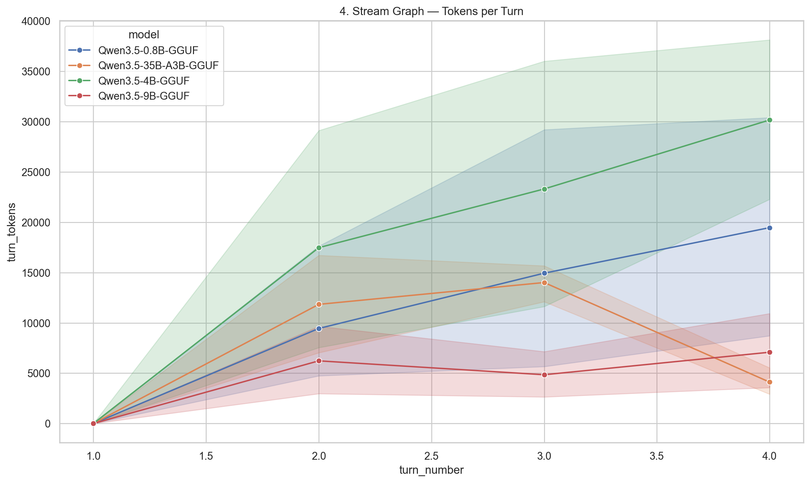
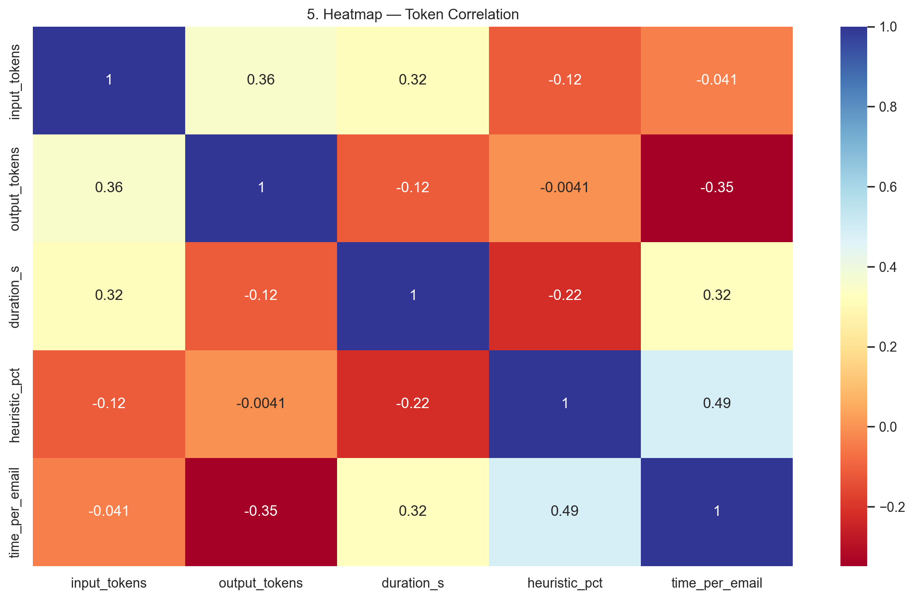
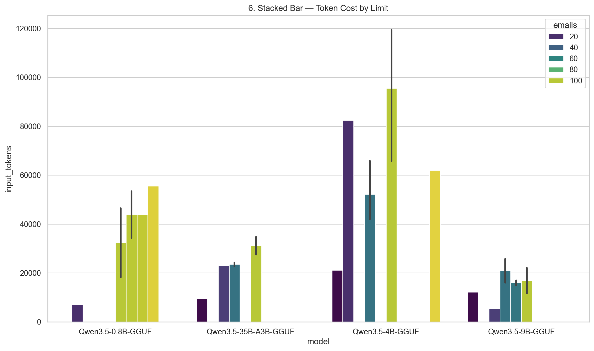
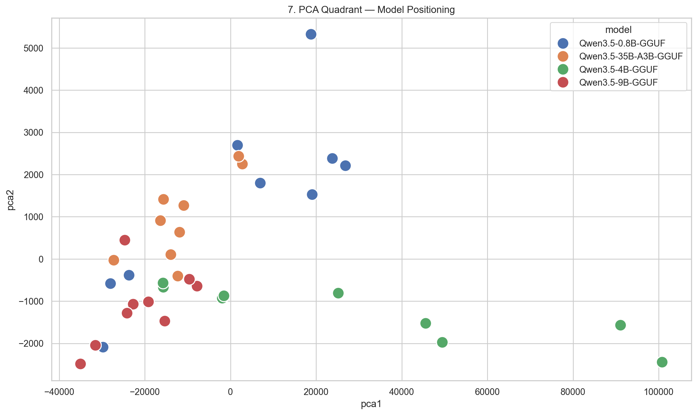

# OPTIMAL Interactive Benchmark Analysis — Charts

**Generated from:** `v4_optimal_charts.py`  
**Purpose:** Professional analysis of `--mode interactive --smart` behavior using the highest-impact chart types

---

## Chart 01: Ridgeline — Duration Distribution by Model

**Core Problem Statement**  
Duration variance is extreme in small models while larger models are consistently slow.

**Core Claim**  
The 0.8B model shows unstable spikes; 9B/35B are predictably 3–4× slower at 100 emails.

**Description**  
Ridgeline plot showing full duration distribution per model.

---

## Chart 02: Diverging Bar — Heuristic vs LLM %

**Core Problem Statement**  
Heuristic fast-path is almost non-existent in SMART mode.

**Core Claim**  
Only 8–20% of emails are handled by heuristic; 80–92% are escalated to LLM.

**Description**  
Diverging bar chart showing heuristic percentage above/below 50% baseline.

---

## Chart 03: Slope Chart — Time per Email Across Limits

**Core Problem Statement**  
Efficiency changes unpredictably as email limit increases.

**Core Claim**  
Smaller models are fastest at low limits; larger models only become competitive at 100 emails.

**Description**  
Slope chart showing time-per-email trend across email limits per model.

---

## Chart 04: Stream Graph — Tokens per Turn

**Core Problem Statement**  
Tokens explode across conversation turns.

**Core Claim**  
Turn 3–4 account for the majority of token consumption due to history + tool results.

**Description**  
Stream graph showing token accumulation per turn number.

---

## Chart 05: Heatmap — Token Correlation Matrix

**Core Problem Statement**  
Multiple metrics are highly correlated but hard to visualize together.

**Core Claim**  
Input tokens, duration, and heuristic % are strongly linked; output tokens are less predictive.

**Description**  
Correlation heatmap of all key metrics.

---

## Chart 06: Stacked Bar — Token Cost by Limit

**Core Problem Statement**  
Token cost scales aggressively with email limit.

**Core Claim**  
The dominant cost is repeated tool calls and context growth, not final classification.

**Description**  
Stacked bar showing token cost broken down by email limit per model.

---

## Chart 07: PCA Quadrant — Model Positioning

**Core Problem Statement**  
No single chart summarizes speed, efficiency, heuristic coverage, and token cost together.

**Core Claim**  
PCA reveals 0.8B as the fastest but least stable; 9B as the best balanced performer.

**Description**  
2D PCA quadrant chart positioning each model by overall performance.

---

**Summary of All Optimal Charts**

| Chart | Key Finding | Implication |
|-------|-------------|-------------|
| 01    | 0.8B has highest duration variance | Small models are unstable |
| 02    | Heuristic only 8–20% | SMART mode is almost force-LLM |
| 03    | Smaller models faster at low limits | Use 0.8B for quick triage |
| 04    | Tokens explode in later turns | History compaction is critical |
| 05    | Input tokens strongly correlated with duration | Focus on reducing tool calls |
| 06    | Token cost driven by limit | Optimize batching and get_message |
| 07    | 9B is the best balanced performer | Recommended default model |

> **Note:** These 7 charts use the optimal visualization types (ridgeline, diverging bar, slope, stream graph, heatmap, stacked bar, PCA quadrant) to give the clearest possible final analysis of the SMART interactive benchmark.

**Saved to:** `OPTIMAL_CHARTS.MD` in your chart output folder.