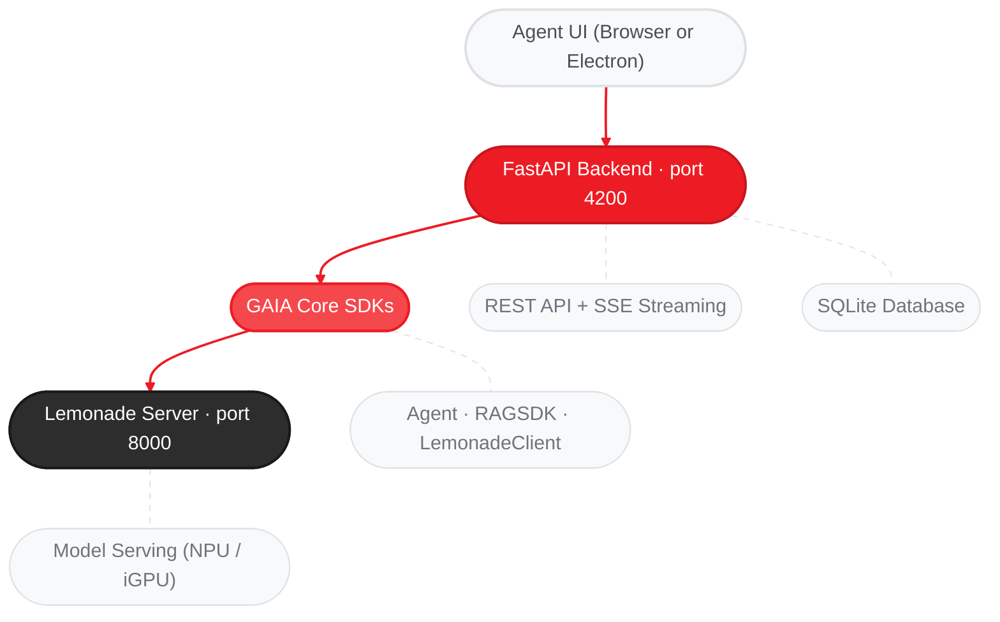

GAIA Agent UI is a desktop interface for running AI agents **100% locally** on your AMD hardware. Use agents to analyze documents, generate code, answer questions, and accomplish tasks on your PC — all without sending data to the cloud.

<Info>
  This guide assumes you have completed the [Quickstart](/quickstart) and have GAIA installed.
</Info>

<Warning>
  **Tested Configuration:** The Agent UI has been tested exclusively on **AMD Ryzen AI MAX+ 395** processors running the **Qwen3.5-35B-A3B-GGUF** model via Lemonade Server. Other hardware or model combinations may work but are not officially verified.

  If you encounter issues on a different configuration, please [open a GitHub issue](https://github.com/amd/gaia/issues/new) and include:
  - Your processor model (e.g., Ryzen AI 9 HX 370, Ryzen AI MAX+ 395)
  - RAM and available memory
  - The LLM model you are using
  - Operating system and version
  - Steps to reproduce the issue
</Warning>

---

## Getting Started

### Prerequisites

The Agent UI requires two backend services:

1. **Lemonade Server** — serves the LLM locally (port 8000)
2. **A downloaded model** — the LLM the agent uses to reason

<Note>
  **Using the npm install?** `gaia-ui` handles prerequisite #1 and #2 automatically on first run (installs Lemonade Server and downloads a minimal model). You can skip to [Install and Launch](#install-and-launch).
</Note>

If you're using the Python CLI path, or want the full-size model, run:

```bash
gaia init --profile chat
```

This downloads Lemonade Server and the recommended model (~25 GB). Use `--profile minimal` for a smaller download (~400 MB).

Then start the server:

```bash
lemonade-server serve
```

### Install and Launch

Choose one of the two install paths:

<Tabs>
  <Tab title="npm (Recommended)">
    The npm package bundles everything — on first run it auto-installs the Python backend (uv, Python 3.12, amd-gaia), Lemonade Server, and a minimal model.

    **Requires:** [Node.js 18+](https://nodejs.org) (`winget install OpenJS.NodeJS.LTS` on Windows, `brew install node@20` on macOS)

    ```bash
    npm install -g @amd-gaia/agent-ui
    ```

    Then launch:

    ```bash
    gaia-ui
    ```

    The Agent UI opens automatically in your browser at [http://localhost:4200](http://localhost:4200).

    **Options:**

    | Flag | Description |
    |------|-------------|
    | `gaia-ui --port 8080` | Custom port |
    | `gaia-ui --no-open` | Don't auto-open the browser |
    | `gaia-ui --serve` | Serve frontend only (Node.js static server) |
    | `gaia-ui --version` | Show version |

    **Update:**

    ```bash
    npm install -g @amd-gaia/agent-ui@latest
    ```
  </Tab>

  <Tab title="Python CLI">
    If you already have GAIA installed via pip/uv, launch the Agent UI directly:

    ```bash
    gaia chat --ui
    ```

    Or equivalently:

    ```bash
    gaia --ui
    ```

    The Agent UI starts on [http://localhost:4200](http://localhost:4200). Open this URL in your browser.

    <Note>
      **Source/dev installs:** The frontend is built during `gaia init`. If you see a JSON response instead of the UI, run `gaia init` or manually build (from the repo root):

      ```bash
      cd src/gaia/apps/webui && npm install && npm run build
      ```
    </Note>

    **Options:**

    | Flag | Description |
    |------|-------------|
    | `gaia chat --ui --ui-port 8080` | Custom port |
    | `gaia --ui --ui-port 8080` | Custom port (top-level alias) |
    | `gaia --ui --base-url http://192.168.1.100:8000/api/v1` | Connect to Lemonade on another machine (e.g., GPU workstation) |

    <Note>
      If you see a missing dependencies error, install the UI extras:

      ```bash
      uv pip install "amd-gaia[ui]"
      ```
    </Note>
  </Tab>
</Tabs>

---

## What You Can Do

### Search and Browse Files

The agent has access to your local file system. Ask it to find files, explore directories, or locate specific content across your projects — no manual browsing required.

### Analyze Documents

Once the agent finds files — or you drag them into a session — it can index and analyze their content. Ask it to summarize, compare, extract data, or answer questions about any supported format:

- **Documents:** PDF, Word, PowerPoint, Excel, TXT, Markdown, CSV, JSON, HTML, XML, YAML
- **Code:** Python, JavaScript, TypeScript, Java, C/C++, Go, Rust, Ruby, Shell
- **Config:** INI, CFG, TOML, YAML, JSON, XML

### Session Management

Create, rename, search, export (Markdown/JSON), and delete sessions. Sessions persist across the CLI (`gaia chat`) and the Agent UI.

---

## Keyboard Shortcuts

| Shortcut | Action |
|----------|--------|
| `Enter` | Send task / message |
| `Shift+Enter` | New line |
| `Escape` | Stop agent response |
| `Ctrl+K` | Focus sidebar search |

---

## Pipeline Runner

The Agent UI includes a built-in **Pipeline Runner** for executing the 5-stage autonomous agent pipeline with real-time SSE streaming. This feature allows you to run complex AI workflows that automatically plan, build, validate, and iterate on tasks until quality thresholds are met.

### Accessing the Pipeline Runner

Click the **Run Pipeline** button in the sidebar (⚡ icon) to open the Pipeline Runner page. The Template Manager is accessible from the same navigation area for managing pipeline templates.

### Pipeline Configuration

The Pipeline Runner provides a configuration form with the following options:

| Field | Description |
|-------|-------------|
| **Task Description** | Natural language description of what you want the pipeline to analyze or build |
| **Session** | Select an existing session to associate with the pipeline execution |
| **Auto-spawn** | Enable automatic agent spawning when capability gaps are detected (requires Claude Code environment) |
| **Template** | Optional pipeline template to use for routing and quality thresholds |

<Tip>
  **Auto-spawn requires Claude Code.** When enabled, the Gap Detection stage can invoke `master-ecosystem-creator.md` to generate missing agents automatically. Running outside Claude Code will result in silent failures when gaps are found. Use the Template Manager to pre-configure templates with required agents.
</Tip>

### The 5 Pipeline Stages

The Pipeline Runner displays real-time progress through 5 autonomous stages:

```
┌─────────────────┐
│  Task Input     │
└────────┬────────┘
         │
         ▼
┌─────────────────┐
│ Stage 1:        │
│ Domain Analyzer │ → Analyzes task to identify knowledge domains
└────────┬────────┘
         │
         ▼
┌─────────────────┐
│ Stage 2:        │
│ Workflow Modeler│ → Models workflow and recommends required agents
└────────┬────────┘
         │
         ▼
┌─────────────────┐
│ Stage 3:        │
│ Loom Builder    │ → Builds execution topology (agent graph)
└────────┬────────┘
         │
         ▼
┌─────────────────┐
│ Stage 4:        │
│ Gap Detector    │ → Compares required vs available agents
└────────┬────────┘
         │
    ┌────┴────┐
    │ Gaps?   │
    └────┬────┘
      Yes│No
         │     ┌──────────────────────────┐
         │     │ Master Ecosystem Creator │
         └────→│ (Generates missing agents)│
               └────────────┬─────────────┘
                            │
         ▼                  │
┌─────────────────┐         │
│ Stage 5:        │◄────────┘
│ Pipeline Exec.  │ → Executes complete agent pipeline
└─────────────────┘
```

The stage indicator at the top of the execution view shows which stage is active (highlighted) and which stages are complete (checkmark).

### Real-Time Event Log

The Pipeline Runner streams SSE (Server-Sent Events) in real-time to an event log. Each event is color-coded and expandable:

| Event Type | Icon | Description |
|------------|------|-------------|
| `status` | Terminal | Pipeline status updates (starting, running, completed, failed) |
| `step` | Chevron | Stage transitions and progress markers |
| `thinking` | Alert | LLM reasoning and decision-making output |
| `tool_start` | Chevron | Tool execution beginning |
| `tool_end` | Check | Tool execution completed successfully |
| `tool_result` | Terminal | Tool execution results |
| `done` | Check | Pipeline completed successfully |
| `error` | XCircle | Pipeline failed with error |

Click the chevron icon on any event to expand and view full details, including tool arguments and results.

### Execution History

Each pipeline run is preserved in execution history with:

- **Run ID** — Unique identifier (first 8 characters shown)
- **Status** — Current state (starting, running, completed, failed, cancelled)
- **Timestamps** — Start and end times
- **Task Description** — The original task input
- **Event Log** — Complete SSE event stream with expandable details

Use the **Clear History** button to remove all completed executions. Individual executions can be deleted using the trash icon in the execution header.

### Managing Pipeline Runs

| Action | Description |
|--------|-------------|
| **Run Pipeline** | Start a new pipeline execution with the configured settings |
| **Cancel** | Stop a running pipeline (marks as failed with "Cancelled by user" error) |
| **Clear History** | Remove all completed execution records |
| **Delete Execution** | Remove a specific execution from history |
| **Manage Templates** | Navigate to the Template Manager to create or edit pipeline templates |

### Troubleshooting

<AccordionGroup>
  <Accordion title="Auto-spawn silently fails">
    The auto-spawn feature requires a Claude Code environment. When running outside Claude Code, the Gap Detector stage will detect gaps but cannot spawn new agents. Disable auto-spawn or use pre-configured templates with all required agents.
  </Accordion>

  <Accordion title="Pipeline fails immediately">
    Ensure Lemonade Server is running and the selected session is valid. Check the event log for the specific error message.
  </Accordion>

  <Accordion title="No templates in dropdown">
    Templates are managed separately in the Template Manager. Click "Manage Templates" to create your first template.
  </Accordion>
</AccordionGroup>

[→ Full Pipeline Orchestration Guide](/guides/pipeline) | [→ Pipeline SDK Reference](/sdk/infrastructure/pipeline)

---

## MCP Server

The Agent UI includes a built-in **MCP (Model Context Protocol) server** that exposes the full Agent UI as a set of tools. This lets external AI assistants — like **Claude Code**, **Cursor**, or any MCP-compatible client — interact with GAIA agents through the same backend that powers the web UI.

Conversations initiated via MCP appear in the browser UI in real time, so you can watch tool execution and agent activity as it happens.

The MCP server provides 15 tools for managing sessions, sending messages, indexing documents, browsing files, and more.

See the [Agent UI MCP Server guide](/guides/mcp/agent-ui) for setup instructions and usage examples.

---

## Troubleshooting

<AccordionGroup>
  <Accordion title="Lemonade Server not running">
    Start Lemonade with `lemonade-server serve`. If Lemonade is not installed, follow the initialization steps in the [Quickstart](/quickstart#cli-install).
  </Accordion>

  <Accordion title="No model loaded">
    Download models with `gaia init --profile chat`. See the [Quickstart](/quickstart#cli-install) for details.
  </Accordion>

  <Accordion title="Port 4200 already in use">
    ```bash
    # npm CLI
    gaia-ui --port 8080

    # Python CLI
    gaia --ui-port 8080
    ```
  </Accordion>

  <Accordion title="Database locked error">
    Close any other GAIA Agent UI or CLI instances. Only one writer at a time is supported.
  </Accordion>

  <Accordion title="Document indexing fails">
    - Ensure the file is a supported format and not password-protected
    - Keep file size under 100MB
    - For PDF image extraction, download the VLM model: `gaia download --agent chat`
  </Accordion>

  <Accordion title="Frontend shows JSON instead of the UI">
    The Agent UI frontend has not been built.

    **npm install (`gaia-ui`):** This is handled automatically — `gaia-ui` tells the Python server where to find the pre-built frontend. If you still see this error, try reinstalling: `npm install -g @amd-gaia/agent-ui@latest` Then restart with `gaia-ui`.

    **Source/dev installs (git clone):** Run `gaia init` to build it automatically, or manually (from the repo root):

    ```bash
    cd src/gaia/apps/webui && npm install && npm run build
    ```

    Then restart `gaia chat --ui`.

    **pip/PyPI installs (without gaia-ui):** Use the [npm install path](#install-and-launch) — the pip package does not include frontend source files.
  </Accordion>
</AccordionGroup>

---

## Architecture



For the REST API reference and backend classes, see the [Agent UI SDK Reference](/sdk/sdks/agent-ui).

---

## Next Steps

<CardGroup cols={2}>
  <Card title="Agent UI SDK Reference" icon="code" href="/sdk/sdks/agent-ui">
    REST endpoints, database schema, and Python backend API
  </Card>

  <Card title="Document Q&A Agent" icon="file-lines" href="/guides/chat">
    CLI-based document agent with RAG, debug mode, and chunking strategies
  </Card>

  <Card title="Build Your First Agent" icon="rocket" href="/quickstart#build-your-first-agent">
    Create a custom agent with tools in minutes
  </Card>

  <Card title="MCP Server" icon="plug" href="/guides/mcp/agent-ui">
    Connect Claude Code, Cursor, or any MCP client to the Agent UI
  </Card>
</CardGroup>

---

<small style="color: #666;">

**License**

Copyright(C) 2024-2026 Advanced Micro Devices, Inc. All rights reserved.

SPDX-License-Identifier: MIT

</small>